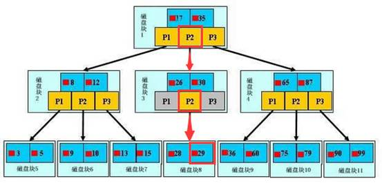

[toc]
# mysql索引&慢查询

标签 ： 索引 慢查询

[参考1](https://tech.meituan.com/mysql-index.html)
[参考2](https://juejin.im/entry/590a973561ff4b00698921b8)

---

## 定位数据库问题方法
### 慢查询
    查询超过指定时间long_query_time的sql语句查询
#### 开启方法
long_query_time定义慢于多少秒算慢查询,查询该值`show variables like 'long%'`,设置该值慢于2秒为慢查询 `set long_query_time=2`,也可以使用my.cnf或my.ini修改,前者改完就生效,查看是否生效`show variables like 'slow%'`
如果`slow_query_log=on`则为开启

#### 查看查询慢日志
`mysqldumpslow`用于统计和展示慢日志里的mysql
常用参数
-s:表示用何种方式排序,`c`执行次数 `t`执行时间 `l`等待锁时间 `r`返回记录数, `ac` `at` `al` `ar`表示相对应的平均值
-r:是前面排序的逆序
-t:返回排序后前几行
-g:正则匹配模式,大小写不敏感

`ex.` 
`mysqldumlslow -s c -t 5 /data/mysql-slow.log` 得到执行次数最多的前5个查询
`mysqldumpslow -s r -t 10 /data/mysql-slow.log` 得到返回记录数最多的前10个查询

### explain
    分析查询sql的性能工具
- 用法
`explain tablename` 返回表的字段结构信息
`explain select xxx`返回相关的索引使用信息
- 通过该命令可以得到
`表的读取顺序`,`读取数据时操作类型`,`哪些索引可以用`,`实际用到哪些索引`,`表之间的引用`,`每张表被优化器查询行数`
- 返回参数
 - id
本次select的标识符,在查询中每个select都有一个顺序值,也可以看出哪个表先查询
 - select_type
select查询类型,主要用来区分普通查询,联合查询以及子查询之类的复杂查询,主要有以下几种
`SIMPLE` :简单查询,不涉及联合查询和子查询
`PRIMARY`：子查询中最外层的 select。
`UNION`：UNION 中的第二个或后面的 SELECT 语句。
`DEPENDENT UNION`：UNION 中的第二个或后面的 SELECT 语句，取决于外面的查询。
`UNION RESULT`：UNION 的结果。
`SUBQUERY`：子查询中的第一个 SELECT。
`DEPENDENT SUBQUERY`：子查询中的第一个 SELECT，取决于外面的查询。
`DERIVED`：派生表的 SELECT(FROM 子句的子查询)。
 - table
输出行所用的表
 - partitions
 - type
联合查询使用的类型,结果值从好到坏依次是
system > const > eq_ref > ref > fulltext > ref_or_null > index_merge > unique_subquery > index_subquery > range > index > ALL
一般来说，得保证查询至少达到 range 级别，最好能达到 ref。
 - posible_keys
该查询中可以使用那些索引进行查询,如果为空,说明没有相关索引可以被使用,这时如果要提高性能,可以看where条件看哪些字段可以建索引
 - key
查询中使用到的索引
 - key_len
mysql使用的建长度,如果是多重主键,可以看出时间使用了拿部分主键
 - ref
显示哪些字段和key一起被使用了
 - rows
为了得到数据,总共查询了多少条数据 `这个是核心指标,大多数情况下越小查询的越快`
 - filterd
 - extra
除了使用key主键外还使用了其他条件进行查询,具体有下面几个
`using index`只用索引树中的信息就查询出数据
`using where` 用上了where条件限制
`using impossible` 可能没有用上where条件,一般就是没有查询到数据
`using filesort`或`using temporary` 说明查询很吃力,where和order by的索引无法兼顾,如果按照 WHERE 来确定索引，那么在 ORDER BY 时，就必然会引起 Using filesort，这就要看是先过滤再排序划算，还是先排序再过滤划算

### 优化基本步骤
 - 先运行看是否真的很慢,注意设置 sql_no_cache
 - where条件单表查,所得最小返回记录表,就是说把where条件应用到每个表中把返回最小记录的表先查询.单表每个字段分别查询，看哪个字段的区分度最高
 - explain 执行查询看执行是否与1预期一致(从锁定记录最少的表开始查询)
 - order by limit 形式的sql语句让排序的表先查
 - 了解业务使用场景
 - 加索引,看下面建索引部分的原则
 - 看结果,若不符合预期从0开始分析

## 索引
### 索引目的
提高查询速度
### 索引原理
通过尽可能不断的缩小查询范围,获取数据.把随机事件变成有顺序的事件.也就是说可以总是通过同一种方法来锁定数据.
数据库也是一样.但是更复杂,包含多种查询比如:`等值查询` `范围查询` `模糊查询` `并集查询`.数据库使用分段查询类似字典目录,缩小返回.
### 索引结构

浅蓝色为一个磁盘块,每个磁盘块包含两个东西,`数据项`,`指针`真实数据存在叶子节点,非叶子节点不存储真实数据,只存储指引搜索方向的数据项

- b+查找过程
如图所示，如果要查找数据项29，那么首先会把磁盘块1由磁盘加载到内存，此时发生一次IO，在内存中用二分查找确定29在17和35之间，锁定磁盘块1的P2指针，内存时间因为非常短（相比磁盘的IO）可以忽略不计，通过磁盘块1的P2指针的磁盘地址把磁盘块3由磁盘加载到内存，发生第二次IO，29在26和30之间，锁定磁盘块3的P2指针，通过指针加载磁盘块8到内存，发生第三次IO，同时内存中做二分查找找到29，结束查询，总计三次IO。真实的情况是，3层的b+树可以表示上百万的数据，如果上百万的数据查找只需要三次IO，性能提高将是巨大的，如果没有索引，每个数据项都要发生一次IO，那么总共需要百万次的IO，显然成本非常非常高。
- b+索引性质
 - `索引字段要尽量的小`;查询数据的io次数有树的高度h决定,越高io次数越多,
如果数据量一定为n,每个磁盘块的数据项数量为m,当m越大h越小,m数据量由数据项(`索引字段`)大小和磁盘块大小决定,磁盘块大小是固定的,数据项越小,数据量就越大.所以应该索引项要尽量的小.
 - `索引的最左匹配`:当b+树的数据项是复合的数据结构，比如(name,age,sex)的时候，b+数是按照从左到右的顺序来建立搜索树的.

### 索引不足
 - 索引需要空间
 - 索引需要维护(数据变更时)

### 索引分类
- 主键索引`primary key`
 - 一个数据只有一个主键
- 唯一索引`unique`
 - 列的值必须唯一,但是可以为空,如果是组合索引那么列值得组合必须唯一.
`alert table tablename add unique (colum)`
- 普通索引`index`
 - 最基本索引,没有限制
`alert table tablename add index index_name(colum)`
- 组合索引`index`
 - 一个索引包含多个列
`alert table tablename add index index_name(colum1,colum2)`
- 全文索引`fulltext`
 - 利用分词等各种算法分析出文字中各个词的频率及重要性,然后按照一定算法筛选出搜索结果
`alert table tablename add fulltext(colum)`

###建索引原则 
- 最左前缀匹配原则
 >mysql会一直向右匹配直到遇到范围查询(>,<,between,like)停止匹配,比如a = 1 and b = 2 and c > 3 and d = 4 如果建立(a,b,c,d)顺序的索引，d是用不到索引的，如果建立(a,b,d,c)的索引则都可以用到，a,b,d的顺序可以任意调整

- =和in可以乱序，比如a = 1 and b = 2 and c = 3 建立(a,b,c)索引可以任意顺序
- 尽量选择区分度高的列作为索引
- 索引列不能参与计算
- 尽量的扩展索引，不要新建索引。比如表中已经有a的索引，现在要加(a,b)的索引，那么只需要修改原来的索引即可

### sql优化
- 有索引未使用
 - like以通配符开头
 - where条件不符合最左匹配原则
 - 使用 != ,<> 操作符
 - 索引列参与计算,否则放弃索引查询
 - 对字段进行null判断,字段默认值不应为null
 - 使用or来连接,可以使用`union all`
- 避免`*`查询
- order by limit字段排序,1:添加索引,2:让排序的表优先查,3:避免使用表达式
- group by 查询.,可以将不需要的数据在group by前面过滤掉
- 用exists 代替in
- 用varchar 代替char
- 能用distinct 就不用group by
- 能用 union all 就不用 union
- join表时使用相当类型的类,并添加索引

