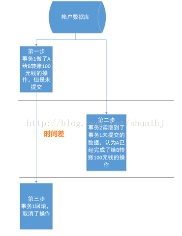
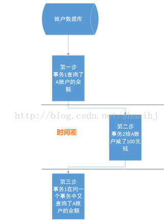
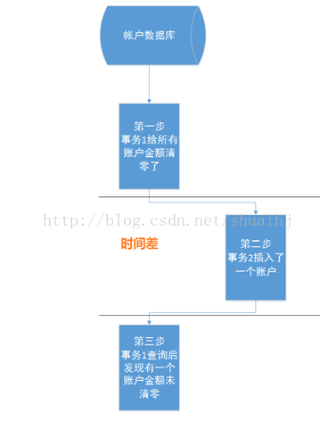

# mysql事务、锁、隔离级别

## 事务
> 事务
对数据库进行操作的一系列操作的集合具有ACID属性
ACID特性由数据库管理系统来实现。
acd 由日志来保证，日志记录了事务对数据库所有的更改，如果摸个事务执行发生错误，就可以更具日志撤销事务对数据的所有更改，退回到事务执行前的状态。
i由数据库管理系统采用锁机制来实现，当多个事物同时更新相同数据，只有允许持有锁的事务对该数据进行更新，其他事务等待，直到前一个事务释放锁，其他事务才有机会更新该数据。
### 原子性（atomicity）
> 一个事务被视为不可分割的最小工作单元，整个事物中的操作要么全部成功，要么全部失败。
### 一致性（consistency）
> 数据总是从一个一致性转换到另外一个一致性，比如转账a减100，那么b必须加一百，总金额不会少100始终保持最终一致性。要么在a，要么在b，数据原有的一致不会被打破。
### 隔离性（isolation）
> 一个事务的执行不会影响到另外其他的事务，对其他事务不可见，具体表现形式更具不同的隔离级别表现形式不一样。
### 持久性（durability）
> 事务提交，数据库永久保持更改。

## 锁
> 锁
为了解决数据库并发时，保证数据的一致性，而对并发进行控制的一种机制。
ex. 同一条数据有多个客户端在操作，A 读取操作，b 修改操作，c 去删除。
### 锁分类
> 从对数据操作类型（读、写）分

- 读锁（共享锁）：同一块数据，多个读操作同时进行，互相不会受影响
- 写锁（排他锁）：当前操作没有完成前会阻止其他写锁和读锁进行，等待或超时

### 锁粒度
> 为了提升数据库的并发量，锁住的数据越少越好，
加锁也需要消耗资源，包括获得锁，检查锁，是否解除，释放锁。锁策略就是在锁开销和数据安全之间寻求平衡。为了在并发量和系统性能之间平衡，产生了锁粒度。

- 表锁：开销小，加锁快，粒度大，不会出现死锁，锁冲突概率最大，并发量也最小。myiasm存储引擎使用。当写入时整个表锁定，任何其他写、读锁都是等待中。写锁比读锁有更高的优先级，因此写锁可能会被插入到读锁队列前面执行。
- 行锁：并发量最大，开销也最大，锁粒度小，锁冲突概率最小。innodb使用这种策略。
- 页面锁：开销和加锁时间以及粒度介于表锁和行锁之间，并发度一般。

### 死锁
> 两个或多个事务在执行过程中，发生争夺资源而互相等待的一个现象。若无外力作用，发生互相等待的进程就是死锁进程。表级锁不会出现死锁，死锁主要发生在innodb引擎中。
死锁的关键在于两个或多个session加锁的顺序不一致，解决就是让加锁有序。（不是太明白）

## 事务隔离
|隔离级别|脏读|更新丢失|不可重复读|幻读|并发模型|
|--------|:------:|------|---------|------|-------:|
|未提交读`read uncommitted`|是|是|是|是|悲观|
|已提交读`read committed`|否|是|是|是|悲观|
|可重复读`repeatbale read`|否|否|否|是|悲观|
|可串行读`serializable`|否|否|否|否|悲观|

> 大多数数据库使用的`read committed`，mysql默认使用的是`repeatable read` 从5.5开始存储引擎默认innodb。建议使用innodb，不在使用myiasm。

### 更改事务隔离级别
> global 设置全局默认隔离级别，session只设置这次打开的cmd窗口中的所有事务隔离级别，并在当前这个事务中生效，在打开一个cmd不受影响。如果不设置则为设置本次命令及以后的隔离级别，如果下个事务没有使用set设置会调用默认隔离级别。
>看`read committed ` 和 `read uncommitted`的效果需要关掉autocommit，否则sql语句运行会自动隐式的执行commit

```mysql
use test;
select @lx_isolation
set [global|session] transaction isolation level read uncommitted | read committed | repeatable | serializable
```
### 脏读
>a事务读取了b事务未提交的数据，b如果回滚，a事务出现错误


### 不可重复读
>a事务先后执行了两个相同的查询，但是结果不一致，因为该数据被b事务修改并提交，导致a事务先后相同查询结果不一致。


### 幻读
> a事务修改具有摸个相同属性的批量数据，b事务此时写入该属性的一条新数据，a事务查询修改发现有一条数据没有被更改，出现幻觉。


### 数据丢失更新
> a，b事务同时读取一条数据，a先修改并提交，b也修改（不知道a修改过），b提交后覆盖a事务修改。

### 未提交读

### 提交读

### 可重复读

### 可串行读

[^footnote] : http://blog.csdn.net/xifeijian/article/details/45229247
[^footnote] : http://www.limisky.com/126.html
[^footnote] : https://tech.meituan.com/innodb-lock.html

